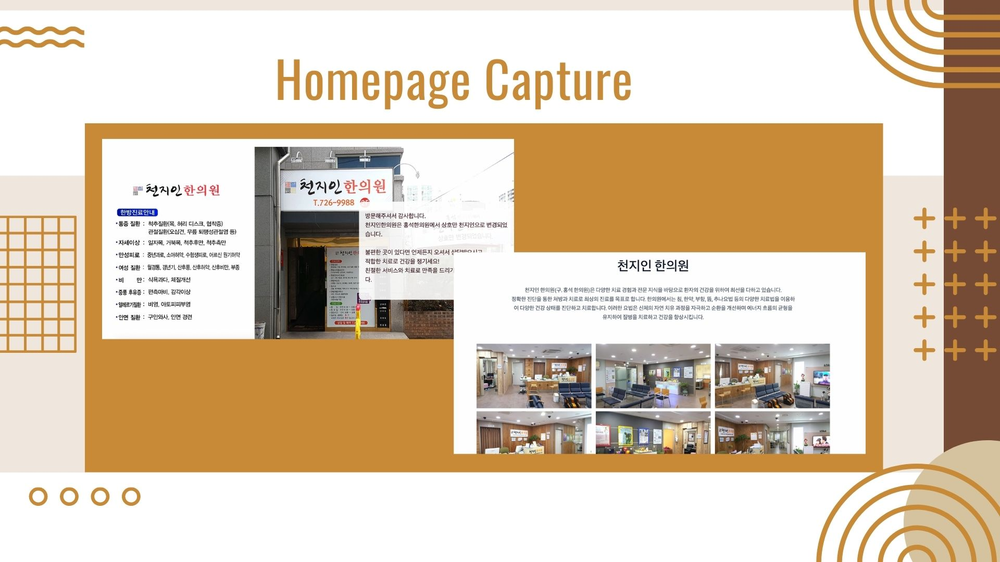

# <h1 style="color:#C38C3E;">천지인 한의원</h1>

 

#### 🔗 홈페이지 링크 : [천지인 홈페이지 바로가기](https://warn-code.tistory.com/)  

 

 

 

## 프로젝트 소개

 

> 개인 프로젝트로 한의원 소개 페이지를 제작하였습니다. 
> 홈페이지를 통해 병원 소개, 운영시간, 진료과목 등을 확인할 수 있습니다.

 

 

## ⚒ 기술 스택

 

> **react 선정 이유**

높은 생산성: React는 컴포넌트 기반 아키텍처를 사용하여 코드의 재사용성과 유지 보수성을 높입니다.

성능: React는 Virtual DOM을 사용하여 불필요한 리렌더링을 줄이고, 필요한 부분만 업데이트하여 더 빠른 성능을 제공합니다.

다양한 생태계: React는 많은 개발자들이 개발한 여러 유용한 라이브러리, 프레임워크, 도구들이 존재합니다. 이를 통해 더욱 쉽고 빠르게 개발할 수 있습니다.
 

 

> **NEXT.js 선정 이유**

Next.js는 React의 서버 사이드 렌더링 및 정적 사이트 생성 기능을 지원하는 프레임워크입니다. 검색 엔진 최적화(SEO)를 향상시킬 수 있어 소개 홈페이지의 목적과 적합하다고 판단하였습니다.

 

> **AOS 선정 이유**

AOS는 애니메이션 효과를 적용하는 라이브러리입니다. AOS는 간단한 설정으로 다양한 애니메이션 효과를 적용할 수 있어, 사용자의 시선을 끌고 사용자 경험을 향상시키고자 선택하였습니다.

 

> **vercel 선정 이유**

Vercel을 사용하면 높은 성능과 안정성을 제공하는 서버리스 애플리케이션을 배포할 수 있고, Next.js 프로젝트를 Vercel에 배포하면 자동으로 성능 최적화를 수행하여 빠르고 안정적인 서비스를 제공할 수 있습니다.

 
